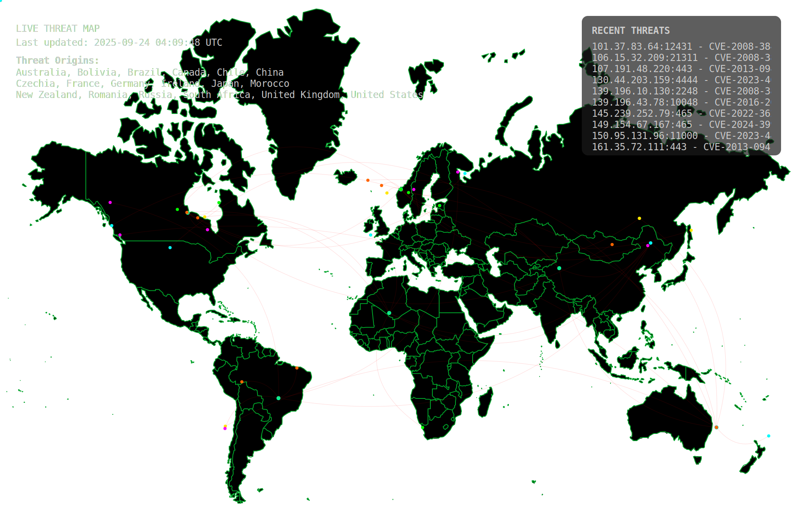
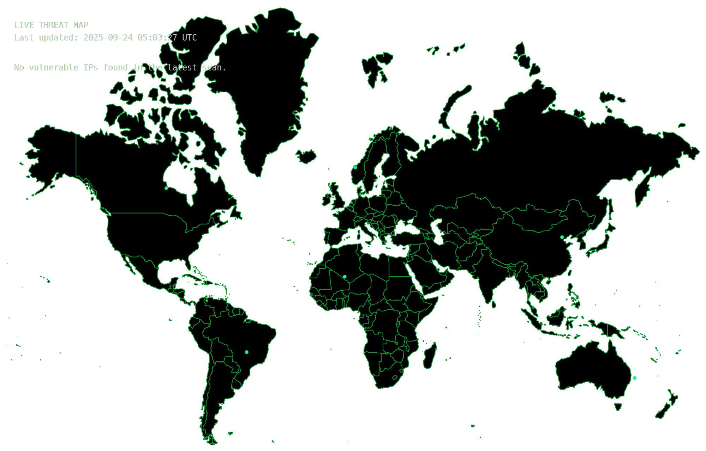

# 🌍 Live Threat Map Dashboard  

  
*A real-time cyber threat visualization powered by Shodan and GitHub Actions.*

---

## ✨ What is This?  
The **Live Threat Map Dashboard** is an automated tool that **fetches real-time threat data from Shodan** and generates a clean, SVG-based world map of ongoing cyber activity.  

- 📡 Uses [Shodan API](https://www.shodan.io/) to gather live data  
- ⚡ Updates **every 6 hours automatically** (via GitHub Actions)  
- 🖼️ Produces a **self-updating `threat-map.svg`** in your repo  
- 🌐 Easy to embed in **README files, dashboards, or websites**  

---

## 🚀 Quick Start  

### 1️⃣ Fork This Repository  
Click the **Fork** button in the top-right corner to create your own copy.  

### 2️⃣ Add Your Shodan API Key  
1. Go to **Settings → Secrets and variables → Actions**  
2. Click **New repository secret**  
3. Add your Shodan key as:  

   - **Name:** `SHODAN_API_KEY`  
   - **Value:** your Shodan API key  

### 3️⃣ Workflow Runs Automatically  
- Runs every **6 hours (UTC)**  
- Commits the new `threat-map.svg` to your repo root  
- You can also run it **manually** from the Actions tab  

---

## ⚙️ GitHub Actions Workflow  

Here’s the workflow that powers the map:  

```yaml
name: Generate Live Threat Map

on:
  # Runs automatically every 6 hours (UTC)
  schedule:
    - cron: "0 */6 * * *"
  # Allows manual trigger
  workflow_dispatch:

jobs:
  generate_threat_map:
    runs-on: ubuntu-latest
    name: Generate and Commit Live Threat Map
    permissions:
      contents: write
    steps:
      - name: Check out the user's repository
        uses: actions/checkout@v4

      - name: Generate Threat Map SVG
        uses: RavinduRathnayaka/LiveThreatMap-dashboard@main
        with:
          SHODAN_API_KEY: ${{ secrets.SHODAN_API_KEY }}
```

---

## 🖼️ Live Demo  

Here’s how the auto-generated map looks in action:  

  

---

## 📦 Use It in Your Own Project  

You can embed the SVG in any Markdown file:  

```markdown

```

Or add it to a dashboard/website as an image source:  

```html
/<your-repo>/main/threat-map.svg" alt="Live Threat Map">
```

---

## 🛠️ Requirements  

- A valid **[Shodan API Key](https://account.shodan.io/)**  
- A GitHub repository with **Actions enabled**  

---

## 🌐 Why Use This?  

- ✅ **Automated** – no manual updates needed  
- ✅ **Visual** – global map for instant insights  
- ✅ **Lightweight** – pure SVG, no heavy dependencies  
- ✅ **Customizable** – fork, modify, and extend  

---

## 📜 License  

This project is licensed under the **MIT License**.  
Feel free to use, modify, and share!  

---

## 💡 Pro Tips  

- Want more frequent updates? Adjust the `cron` schedule in `.github/workflows/generate-threat-map.yml`  
- Use GitHub Pages to **serve the SVG as a live webpage**  
- Combine with other data feeds to build a **security visualization hub**  

---
